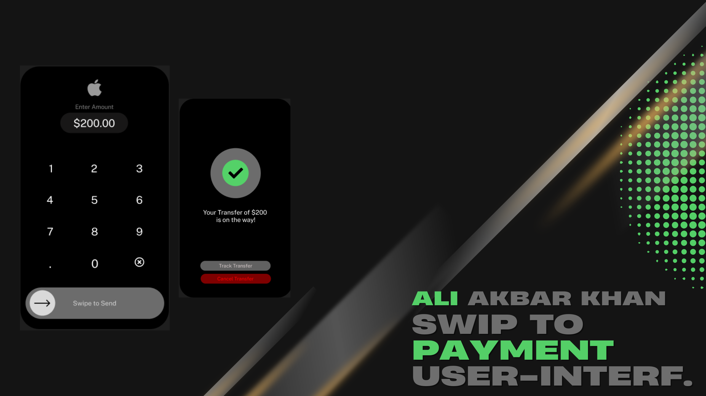

# Payment App Prototype

## Overview 
This repository contains the Figma prototype for a **Payment App**. The app is designed to provide users with a fast, secure, and intuitive platform for managing transactions. The design focuses on simplifying the user experience with easy navigation, clear payment options, and secure features.

## All Rights Reserved.
This repository and its contents are copyrighted. No part of this repository may be reproduced, distributed, or used without explicit permission from the owner.

## Features 
- **Quick Payments**: Easily send or receive money with a few clicks.
- **Bill Management**: Keep track of bills, due dates, and automatic payments.
- **Transaction History**: View detailed payment records in a clean interface.
- **Secure Authentication**: Enhanced security features including fingerprint and facial recognition.

## Prototype Preview 
You can view the prototype on Figma using [this link](https://www.figma.com/community/file/1334538822099072239/swip-up).

## Screenshots 
Here are some key screenshots of the payment app design:

| Home Screen | Payment Options | Transaction History |
|:-----------:|:---------------:|:-------------------:|
|  |  |  |

## Videos 

https://github.com/user-attachments/assets/8d568a6c-0fe5-4467-adbb-f050e1c142c4

## Files in the Repository 
- **Prototype Files** (`.fig`): Figma project file showcasing the payment app design.
- **Screenshots** (`.png`, `.jpg`): Key screens capturing the app interface.
- **Video Demos** (`.mp4`, `.gif`): Short clips demonstrating navigation and core features.
- **Documentation** (`.pdf`): Detailed explanation of the app’s design, user flow, and functionality.

## How to Use 
1. Download the `.fig` file or access the Figma prototype via the link provided.
2. Use Figma to view and explore the design and interaction flow on desktop or mobile devices.

## Future Plans 
- Add interactive prototypes to showcase transaction animations.
- Collect feedback to enhance security and user flow.

## License 
This project is licensed under the [Creative Commons Attribution-NonCommercial-NoDerivatives 4.0 International License](https://creativecommons.org/licenses/by-nc-nd/4.0/legalcode).

## Contributing 
This project is not open for contributions at the moment, but suggestions and feedback are welcome!

